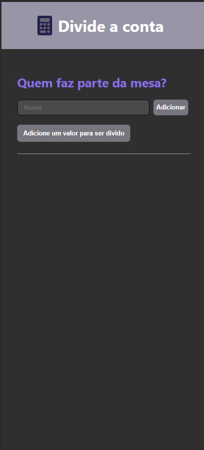
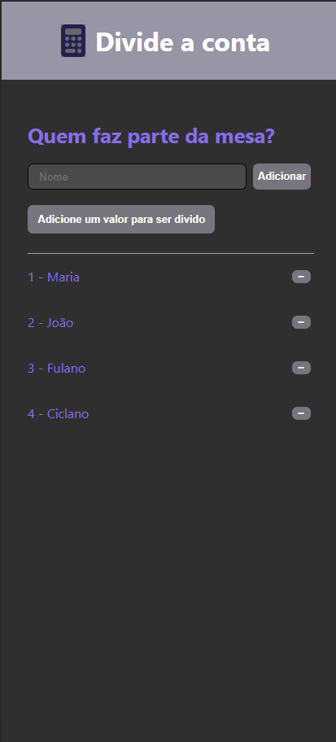
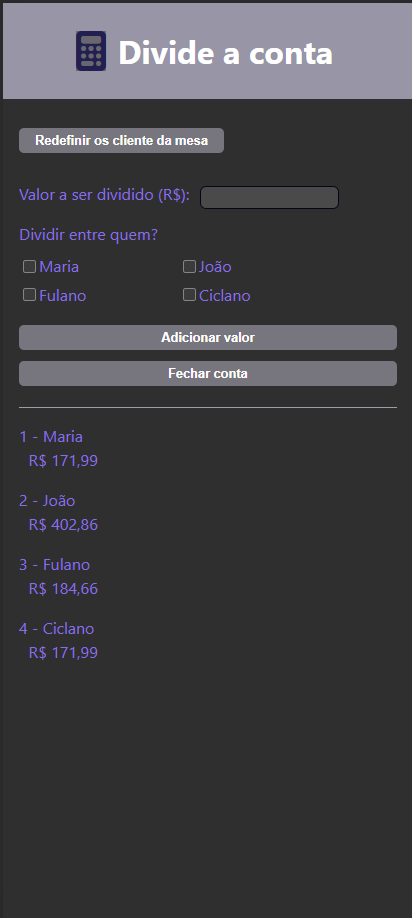
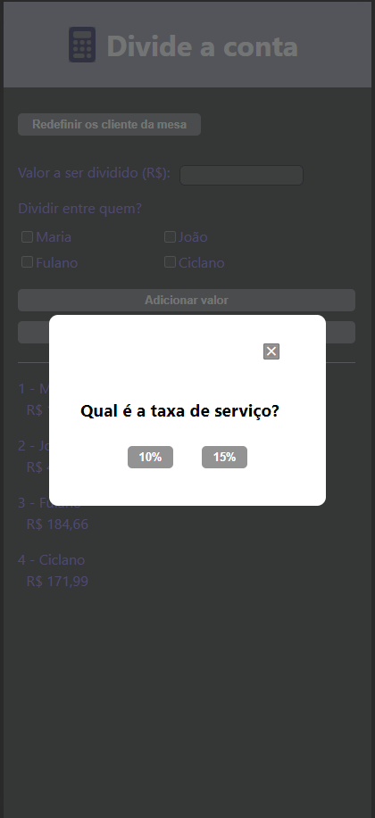
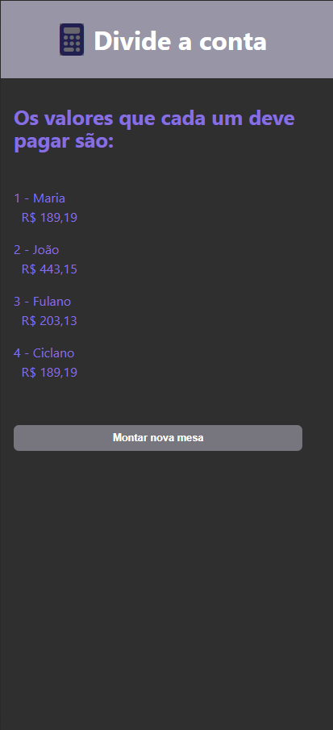

# Split the check - Divide a conta 



This mobile application aims to facilitate splitting bills among consumers at an establishment. Users can effortlessly input the names of individuals sharing the bill, assign respective consumption values, and specify who partook in each item. By accurately recording individual consumption, users can allocate costs accordingly. Finally, users provide the establishment's service charge, and the application computes the final amount each user owes, ensuring a fair and transparent division of expenses.

## Index
- <a href="#functionalities">Application functionalities</a>
- <a href="#layout">Layout</a>
- <a href="#demonstration">Demonstration</a>
- <a href="#run">How to run the application</a>
- <a href="#tecnologies-used">Tecnologies used</a>
- <a href="#developer">Developer</a>
- <a href="#next-steps">Next steps</a>

## Application functionalities
 - [x]  Set a table by adding/removing clients names
 - [x]  Add values and select the users that have to pay for them
 - [x]  Show the parcial amount each customer owes
 - [x]  Select the establishment's service charge
 - [x]  Show the final amount each customer owes

## Layout
1. Mobile










## Demonstration

[Link (deploy)](https://divide-a-conta.surge.sh/)


## How to run the application
```bash
# Clone this repository
$ git clone repolink

# Acess the app folder on your terminal
$ cd split-the-check

# Install the dependencies
$ npm install

# Run the app 
$ npm run dev

# Acesse a apicação pelo navegador:
http://127.0.0.1:5173/
```

## Tecnologies used
1. [React JS](https://react.dev/)
2. [Vite](https://vitejs.dev/)
3. Styled-components
4. React Router
5. React Context
6. React Hooks
7. React Reducer
8. Media Query
9. [Font Awesome Icons](https://fontawesome.com/icons)

## Developer
[LinkedIn](https://www.linkedin.com/in/julia-silva-borges/)

## Next steps
 - [ ] Add responsivity for desktop and bigger screens.
